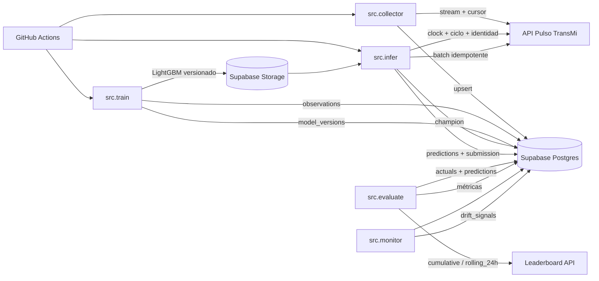

# Pulso TransMi

Plataforma central del primer proyecto de MLOps de Orbital Academy. El reto simula
la demanda de pasajeros en estaciones reales de TransMilenio: los estudiantes
consumen observaciones que aparecen con el tiempo, entrenan y reentrenan modelos,
envían pronósticos y compiten en un leaderboard que cambia cuando el sistema
introduce nuevos patrones y drift.

> **Portal y API — 18 de septiembre de 2026:** la versión `0.5.0` añade el nuevo
> dashboard de carrera, historial visual de accuracy y avatares persistidos por
> cohorte. Conserva el acceso
> estudiantil, emisión y rotación autoservicio de API keys, tablero de conexión
> y una ronda de práctica sin activar todavía la generación dinámica. Todo está
> disponible en `https://pulso-transmi.72-60-245-2.sslip.io`.

El login valida únicamente correo institucional + documento. El nombre ingresado
es una preferencia privada para el saludo; el leaderboard conserva el nombre
oficial de matrícula.

La matrícula activa ya está precargada: 32 estudiantes (20 del grupo A y 12 del
grupo B). Cada persona debe activar su propia API key y realizar una entrega
individual; el repositorio no contiene correos ni documentos del curso.

## Qué se aprende

El objetivo no es obtener una buena predicción una sola vez. Cada estudiante debe
operar un pequeño sistema de ML capaz de:

1. descargar datos incrementales desde una API;
2. validar y versionar los datos usados para entrenar;
3. entrenar, evaluar y versionar un modelo;
4. ejecutar inferencia periódica con GitHub Actions;
5. enviar predicciones trazables antes del cierre de cada ciclo;
6. detectar pérdida de desempeño y drift;
7. decidir cuándo reentrenar sin intervención manual.

El catálogo se basará en nombres y coordenadas reales de estaciones de Bogotá.
La demanda, el clima, los eventos y los cambios de régimen serán sintéticos y
reproducibles.

## Dinámica prevista

- **Frecuencia de observación:** 15 minutos.
- **Publicación:** cada 30 minutos se liberan dos intervalos nuevos por estación.
- **Ciclo de entrega:** cada hora, con ventana de 25 minutos.
- **Horizonte:** cuatro intervalos futuros —15, 30, 45 y 60 minutos— para cada
  estación requerida.
- **Escenario inicial:** 12 estaciones, 45 días de historia y 7 días de
  competencia acelerada.
- **Duración académica:** dos semanas, del 16 al 30 de septiembre de 2026.
- **Métrica principal:** `Accuracy = 100 × max(0, 1 - WAPE)` calculada primero
  por estación y luego promediada.
- **Elegibilidad:** cobertura mínima prevista del 95 %; un target ausente se
  evalúa como predicción cero.
- **Bono:** dashboard en Vercel para visualizar demanda, drift, salud del pipeline
  y posición en el leaderboard.

### Umbrales de monitorización

`src/monitor.py` separa tres señales operativas. Performance drift se activa cuando
la accuracy media por estación de los últimos tres ciclos consecutivos baja de
80 %. El 80 % deja un margen claro frente al baseline observado (≈83,8 %) sin
alertar por una sola ventana ruidosa; exigir tres ciclos reduce falsos positivos.

Data drift usa PSI sobre `observations.value`, comparando las últimas 24 horas
con los 28 días anteriores. Se alerta desde `PSI >= 0,20`, umbral convencional
para un cambio material de distribución. Es una feature observable proxy; cuando
el artefacto incluya distribuciones de features derivadas, debe sustituirse por
esas distribuciones.

Falla operacional se activa si en las últimas 24 horas existe al menos una
ejecución del collector fallida o una submission pendiente. La ausencia de una
submission se trata como señal inmediata porque puede hacer perder una ventana de
25 minutos, aunque el modelo mantenga buena accuracy.

La prueba inicial usa 12 targets —uno por estación— y comprueba integración. Los
ciclos oficiales posteriores usarán 48 targets y activarán el score cuando exista
ground truth revelado.

## Dataset inicial

[`data/starter/`](data/starter/README.md) contiene 45 días de historia, 12
estaciones, frecuencia de 15 minutos y 51.840 observaciones sintéticas. El corte
no incluye los siete días reservados para competencia ni parámetros privados del
generador. Los hashes y el rango temporal están fijados en `metadata.json`.

## Arquitectura

```text
Configuración privada + semilla
              │
              ▼
       Generador sintético ──────► sim.generated_truth (privado)
                                           │
                                           ▼
GitHub Actions ◄── API ◄── observations ◄── Scheduler / reloj virtual
      │                    (solo pasado)             │
      └── predictions ──► submissions ──► scoring ──► leaderboard
```

La separación entre el futuro privado y los datos liberados es el control de
integridad central. El rol de la API no puede leer semillas, parámetros de drift
ni `sim.generated_truth`. PostgreSQL es la fuente de verdad; no se utilizan
Redis, Celery ni un broker en esta versión.

### Componentes

| Componente | Responsabilidad | Estado |
|---|---|---|
| PostgreSQL 17 | Catálogo, simulación privada, competencia y auditoría | Operativo |
| FastAPI | Historia, stream, ciclos, autenticación, entregas y leaderboard | Pública (`0.5.0`) |
| Portal web | Carrera, API key, rotación, recibos y estado de la cohorte | Sesión estudiantil (`0.5.0`) |
| Scheduler | Reloj, publicación, apertura, resolución, scoring y snapshots | Implementado; espera escenario |
| Caddy | TLS y exposición pública del servicio | Operativo |
| GitHub Actions | Pipeline gratuito de cada estudiante | Ejemplo inicial publicado; automatización completa siguiente fase |
| Supabase | Persistencia gratuita de cada solución estudiantil | A cargo de cada estudiante |
| Vercel | Dashboard opcional | Bono |

La arquitectura detallada está en [docs/architecture.md](docs/architecture.md) y
el modelo relacional en [docs/data-model.md](docs/data-model.md).

## Primer acceso y predicción

1. Abre el [portal de Pulso TransMi](https://pulso-transmi.72-60-245-2.sslip.io/).
2. Ingresa con correo institucional y documento. El nombre es solo la forma en
   que el portal te saludará y no tiene que coincidir con la lista.
3. Genera tu API key y guárdala: solo se muestra una vez. Si la pierdes, vuelve
   al portal y rótala; la anterior quedará revocada.
4. Clona este repositorio y ejecuta el baseline:

```bash
git clone https://github.com/uexternadojz/pulso-transmi.git
cd pulso-transmi
python -m venv .venv
source .venv/bin/activate
pip install -r requirements-student.txt
export PULSO_API_KEY="ptm_live_..."
python examples/first_prediction.py
```

El ejemplo descarga el histórico, entrena un Random Forest con variables
temporales y rezagos, descubre los targets abiertos y envía la predicción. La
guía completa está en [Primera predicción](docs/primera-prediccion.md).

## API pública `0.5.0`

La API pública está en `https://pulso-transmi.72-60-245-2.sslip.io`; Swagger se
encuentra en `/docs`. En el VPS el proceso escucha únicamente en
`http://127.0.0.1:8010` y Caddy controla la superficie pública.

| Método | Ruta | Propósito | Requiere BD |
|---|---|---|---|
| `GET` | `/health` | Liveness del proceso | No |
| `GET` | `/ready` | Conectividad con PostgreSQL | Sí |
| `GET` | `/v1/meta` | Versión, manifiesto y enlaces | No |
| `GET` | `/v1/stations` | Catálogo de 12 estaciones | No |
| `GET` | `/v1/observations` | Demanda paginada y filtrable | No |
| `GET` | `/v1/context` | Contexto histórico paginado | No |
| `GET` | `/v1/downloads/{filename}` | CSV y manifiesto estáticos | No |
| `GET` | `/v1/stream/observations` | Nuevos datos de competencia con cursor | Sí |
| `GET` | `/v1/clock` | Estado y hora virtual autoritativa | Sí |
| `GET` | `/v1/forecast-cycles/current` | Ciclo abierto y targets exactos | Sí |
| `GET` | `/v1/me` | Identidad de la API key | Sí + key |
| `POST` | `/v1/submissions` | Envío atómico e idempotente | Sí + key |
| `GET` | `/v1/submissions/{id}` | Recibo propio | Sí + key |
| `GET` | `/v1/leaderboard` | Ranking acumulado o rolling 24 h | Sí + key |
| `POST` | `/v1/portal/login` | Sesión académica del portal | Sí |
| `POST` | `/v1/portal/api-key` | Emisión única de credencial personal | Sí + sesión |
| `POST` | `/v1/portal/api-key/rotate` | Revoca y reemplaza la credencial activa | Sí + sesión |
| `GET` | `/v1/portal/dashboard` | Identidad, ronda y entregas propias | Sí + sesión |
| `GET` | `/v1/portal/leaderboard` | Conexión o ranking de la cohorte | Sí + sesión |

Respuesta esperada de salud:

```json
{"status":"ok","service":"pulso-transmi-api"}
```

El endpoint estático `/v1/observations` no cambia. Para el collector de
competencia se usa `/v1/stream/observations`; así un proceso incremental nunca
confunde el corte inicial con una liberación nueva. El payload, errores y reglas
de reintento están en el [contrato de API](docs/api-contract.md).

## Inicio rápido local

### Requisitos

- Docker Engine con Docker Compose v2.
- `curl` para las comprobaciones básicas.
- Python 3.12 solo si se ejecutan pruebas fuera de Docker.

### 1. Configurar variables

```bash
cp .env.example .env
```

Reemplaza los tres valores `replace-with-...` por secretos diferentes y largos.
No confirmes `.env` en Git. Las variables son:

| Variable | Uso |
|---|---|
| `POSTGRES_DB` | Nombre de la base |
| `POSTGRES_USER` / `POSTGRES_PASSWORD` | Administración e inicialización |
| `API_DB_PASSWORD` | Rol de mínimo privilegio usado por FastAPI |
| `SCHEDULER_DB_PASSWORD` | Rol usado por el scheduler |
| `APP_ENV` / `LOG_LEVEL` | Configuración de ejecución |
| `SCHEDULER_POLL_SECONDS` | Frecuencia con que se comprueba si corresponde un tick |
| `RELEASE_INTERVAL_MINUTES` | Cadencia de publicación; valor oficial 30 |
| `SUBMISSION_WINDOW_MINUTES` | Ventana de entrega; valor oficial 25 |
| `SUBMISSION_MAX_ATTEMPTS` | Intentos válidos máximos por ciclo; valor oficial 3 |

### 2. Validar y levantar

```bash
docker compose config --quiet
docker compose up -d --build
docker compose ps
```

Los scripts de `database/init/` solo se ejecutan al crear un volumen vacío. Para
una base existente se deben aplicar las migraciones de `database/migrations/` de
forma controlada; borrar el volumen no es un mecanismo de migración.

### 3. Verificar

```bash
curl --fail http://127.0.0.1:8010/health
curl --fail http://127.0.0.1:8010/ready
curl --fail http://127.0.0.1:8010/v1/meta
curl --fail 'http://127.0.0.1:8010/v1/observations?limit=10'
docker compose logs --tail=50 scheduler
```

Sin escenario activo, el scheduler registra heartbeat y no modifica datos. Con
un escenario en ejecución, cada tick queda en `ops.job_runs`; el heartbeat
incluye el último resultado.

### 4. Detener sin perder datos

```bash
docker compose down
```

Nunca ejecutes `docker compose down -v` en un entorno que quieras conservar:
elimina el volumen de PostgreSQL.

## Pruebas

```bash
python -m venv .venv
source .venv/bin/activate
python -m pip install -r requirements-dev.txt
pytest -q
```

La suite cubre salud, metadatos, filtros, paginación, descargas, emisión y
rotación de API keys, validación estricta, hashes canónicos y autenticación. La
versión `0.4.2` fue además verificada públicamente con un nombre preferido distinto
al oficial, sin alterar el nombre mostrado en el leaderboard.

## Operación en el VPS

- **Ruta:** `/opt/pulso-transmi`
- **API interna:** `127.0.0.1:8010`
- **PostgreSQL:** sin puerto publicado al host
- **URL pública:** `https://pulso-transmi.72-60-245-2.sslip.io`
- **Exposición pública:** Caddy con HTTPS y rutas explícitamente permitidas

El procedimiento de despliegue, diagnóstico, backup y recuperación vive en el
[runbook del VPS](docs/runbook.md). No copies `.env`, tokens ni contraseñas a
issues, logs compartidos o documentación.

## Flujo previsto para estudiantes

Cada estudiante mantendrá su solución en un repositorio separado de esta plataforma
central. La implementación gratuita objetivo es:

```text
GitHub repository
  ├── código de ingesta, features, entrenamiento e inferencia
  ├── modelo o artefacto versionado
  └── GitHub Actions
          ├── descarga observaciones nuevas usando cursor
          ├── decide si reentrena
          ├── consulta el ciclo y genera la cantidad de targets indicada
          └── envía con API key e Idempotency-Key

Supabase del estudiante
  └── historial, métricas, estado del modelo y datos del dashboard

Vercel opcional
  └── demanda, drift, ejecuciones y leaderboard
```

Las API keys nunca se guardan en código, Supabase del estudiante ni variables
públicas de Vercel. Para inferencia se usa GitHub Actions Secret
`PULSO_API_KEY`. El dashboard propio consulta el leaderboard desde una función
de servidor con la llave protegida; nunca desde una variable `NEXT_PUBLIC_*`.

## Estructura del repositorio

```text
app/                  FastAPI, configuración y scheduler
config/               escenario de ejemplo versionado
database/init/        creación inicial de roles, esquemas y permisos
database/migrations/  cambios incrementales para bases existentes
docs/                 diseño, contratos, progreso y operación
tests/                pruebas automatizadas
Dockerfile            imagen compartida por API y scheduler
docker-compose.yml    stack central del VPS
```

## Hoja de ruta inmediata

1. cargar y validar el catálogo geográfico de las 12 estaciones;
2. implementar el generador reproducible y compilar el primer escenario;
3. calibrar baselines y comprobar que el drift degrada modelos estáticos;
4. completar la prueba de conexión de los 32 participantes;
5. cargar y congelar el escenario oficial;
6. activar backup automático y ensayo de restauración;
7. publicar el starter kit con workflow de GitHub Actions.

El detalle, la evidencia y los criterios de salida se mantienen en
[docs/progress.md](docs/progress.md).

## Documentación

- [Guía metodológica para estudiantes v1.0](docs/guides/pulso-transmi-guia-metodologica-v1.0.pdf)
- [Versiones de la guía metodológica](docs/guides/README.md)
- [Progreso y próximos hitos](docs/progress.md)
- [Arquitectura](docs/architecture.md)
- [Modelo de datos y métrica](docs/data-model.md)
- [Generador de patrones y drift](docs/pattern-generator.md)
- [Contrato de API](docs/api-contract.md)
- [Cliente estudiantil y loop MLOps](docs/student-client.md)
- [Portal del estudiante](docs/portal-estudiante.md)
- [Primera predicción](docs/primera-prediccion.md)
- [Runbook del VPS](docs/runbook.md)

## Repositorio y proyecto operativo

- GitHub: [uexternadojz/pulso-transmi](https://github.com/uexternadojz/pulso-transmi)
- Proyecto Academy en Supabase: `Pulso TransMi — Proyecto 1 MLOps`
- ID operativo: `1dde4b7d-7ab4-4df8-8298-34c25d662750`

## Solución MLOps implementada

### Problema

El sistema predice la demanda futura de las estaciones de TransMilenio para
cuatro horizontes de 15 minutos. El reto combina ingestión incremental,
features temporales, entrenamiento reproducible, validación sin fuga temporal,
entregas idempotentes, evaluación contra valores reales y monitorización de
drift y fallas operacionales.

### Arquitectura



### Esquema de datos

| Tabla | Propósito | Clave principal |
|---|---|---|
| `stations` | Catálogo de estaciones, corredor y coordenadas | `station_id` |
| `observations` | Histórico y stream incremental de demanda | `(station_id, ts)` |
| `collector_runs` | Cursor, estado y filas procesadas por ejecución | `id` |
| `model_versions` | Versiones candidate/champion/retired y artefactos | `version` |
| `predictions` | Predicciones por ciclo, estación y target | `(cycle_id, station_id, target_at)` |
| `actuals` | Valores reales revelados | `(cycle_id, station_id, target_at)` |
| `metrics` | Accuracy, WAPE y cobertura por ciclo/estación | `(cycle_id, station_id)` |
| `drift_signals` | Performance drift, data drift y fallas | `id` |
| `submission_receipts` | Payload, llave idempotente y recibo de cada intento | `(participant_id, cycle_id, attempt)` |

### Reproducir desde cero

```bash
git clone https://github.com/uexternadojz/pulso-transmi.git
cd pulso-transmi
python3 -m venv .venv
source .venv/bin/activate
python -m pip install -r requirements.txt -r requirements-student.txt
```

Configura las credenciales sin incluirlas en Git:

```bash
export PULSO_API_KEY="ptm_live_..."
export SUPABASE_URL="https://tu-proyecto.supabase.co"
export SUPABASE_SERVICE_ROLE_KEY="tu-clave-secreta"
```

Ejecuta el esquema `sql/01_schema.sql` y, si el proyecto ya existía, las
migraciones `sql/02_submission_receipts.sql`, `sql/03_model_promotion_events.sql`
y `sql/02_readonly_views.sql` en el SQL Editor de Supabase. La última crea las
vistas públicas del dashboard y activa RLS sobre las tablas base; concede
`SELECT` únicamente sobre las vistas, nunca sobre submissions, recibos o
credenciales.

Después:

```bash
python -m src.collector
python -m src.train --from-supabase --bucket model-artifacts
python -m src.infer --bucket model-artifacts
python -m src.evaluate
python -m src.monitor
```

Para ejecutar el EDA:

```bash
jupyter notebook notebooks/01_eda.ipynb
```

Los workflows de GitHub Actions automatizan estos pasos y requieren los
secrets `PULSO_API_KEY`, `SUPABASE_URL` y `SUPABASE_SERVICE_ROLE_KEY`.
El entrenamiento programado usa `--from-supabase` para incorporar el histórico
real que el collector ya confirmó, en vez de quedarse con el starter local.
La validación usa 96 cortes horarios con los cuatro horizontes, puntúa el WAPE
oficial sobre las 12 estaciones y equilibra el peso de entrenamiento por
estación. Después de validar, el artefacto de producción se reajusta con todas
las observaciones disponibles. Un candidato solo se promueve si supera 85%, al
mejor baseline y al champion medido en esos mismos ciclos por al menos 0,5
puntos, además de pasar una inferencia de prueba.

En la comprobación offline del 24 de septiembre de 2026, el candidato obtuvo
85,5963% frente a 82,7461% del mejor baseline. El champion obtuvo 85,5984% en
esa misma ventana; por la diferencia mínima, no se justificó reemplazarlo.

### Resultados: baselines vs champion

Accuracy oficial: promedio no ponderado de las 12 accuracies por estación.

| Modelo | +15 min | +30 min | +45 min | +60 min | Promedio |
|---|---:|---:|---:|---:|---:|
| Media móvil | 77.0778 | 70.5461 | 63.7218 | 57.1098 | 67.6139 |
| Naive | 83.3629 | 78.4018 | 72.3882 | 65.3146 | 74.8669 |
| Seasonal naive | 83.7894 | 83.7994 | 83.7869 | 83.7978 | 83.7934 |
| **LightGBM champion** | **87.3088** | **87.0245** | **86.0794** | **85.4195** | **86.4581** |

El champion superó al mejor baseline agregado por `2.6647` puntos porcentuales
y fue promovido solo después de superar la validación y pasar una inferencia de
prueba.
