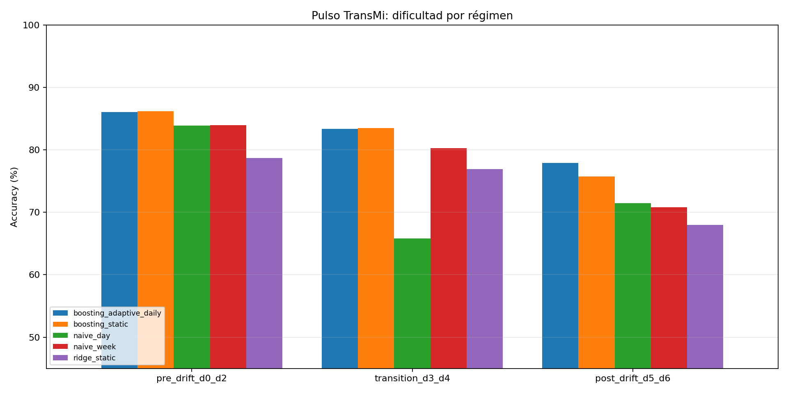
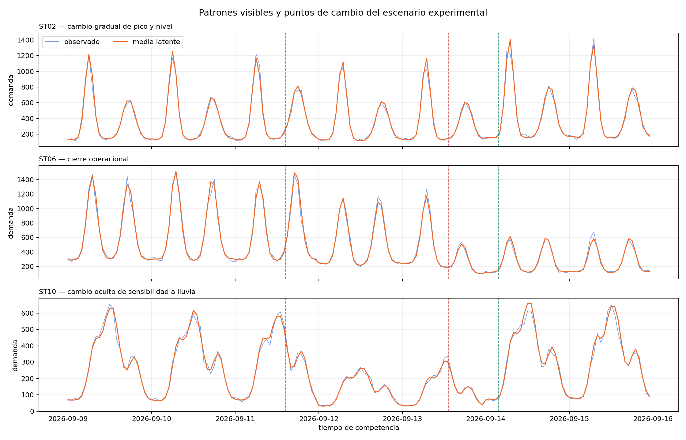

# Análisis de dificultad y recomendación

## Veredicto

El escenario experimental es **difícil pero viable para pregrado**. No se
resuelve con una regresión y tampoco exige deep learning. La ventaja aparece al
combinar buenas features, un modelo no lineal y reentrenamiento después de los
cambios de régimen.

La calibración final redujo el ruido irreducible respecto del primer intento.
Con ello el mejor modelo estático llega a la banda pedagógica deseada antes del
drift, pero pierde desempeño de forma clara cuando el proceso cambia.

## Evidencia principal

Promedio de tres semillas independientes:

| Modelo | Total | Pre-drift | Transición | Post-drift |
|---|---:|---:|---:|---:|
| Naive diario | 76.10 | 83.69 | 67.16 | 71.82 |
| Naive semanal | 78.43 | 83.79 | 80.05 | 70.25 |
| Ridge estática | 75.38 | 78.47 | 77.49 | 68.38 |
| Boosting estático | 82.53 | 86.07 | 83.64 | 75.87 |
| Boosting con reentrenamiento diario | 83.03 | 85.93 | 83.61 | 78.05 |

- La regresión queda aproximadamente **7 puntos** por debajo del boosting.
- El boosting estático pierde **10.20 puntos** entre pre y post-drift.
- Reentrenar recupera **2.18 puntos** post-drift.
- La desviación estándar de la accuracy total es menor de **0.4 puntos** para
  todos los modelos: el resultado no depende de una semilla afortunada.
- En la semilla canónica, el boosting estático va de **74.15 %** en la estación
  afectada por cierre a **86.14 %** en la más estable. Ninguna estación es
  trivial ni queda completamente imposible.

## Qué hace difícil el problema

### Complejidad estructural, no ruido arbitrario

Cada estación combina:

- un arquetipo con uno o varios picos diarios;
- diferencias por día de semana;
- tendencia lenta propia;
- factores latentes de ciudad y estación con autocorrelación;
- sensibilidad heterogénea a lluvia;
- eventos que afectan más a unas estaciones que a otras;
- conteos sobredispersos mediante una binomial negativa.

Esto permite que la exploración y las features ayuden. El ruido evita scores
cercanos a 100 %, pero no domina la serie.

### Cambios de régimen escalonados

1. **Día 2.6 — pico y nivel:** cuatro estaciones cambian gradualmente 45 minutos
   el centro de sus picos y suben 18 % su nivel.
2. **Día 4.55 — cierre y redistribución:** un intercambiador pierde 58 % de
   demanda y dos estaciones relacionadas reciben 24 % adicional.
3. **Día 5.15 — relación con lluvia:** tres estaciones invierten parcialmente
   su sensibilidad histórica al clima.

Los cambios no se deben publicar con esos parámetros. El estudiante debe
descubrirlos mediante residuos, métricas móviles y monitoreo por estación.

## Coherencia con estudiantes de pregrado

El camino de aprendizaje tiene escalones alcanzables:

1. un naive diario o semanal entrega un baseline cercano a 76–78 %;
2. una regresión obliga a construir el pipeline, pero no gana solo por tener
   muchas variables;
3. árboles o boosting con lags y calendario alcanzan cerca de 82–83 %;
4. monitoreo y reentrenamiento mejoran la recuperación después del drift;
5. modelos más sofisticados todavía pueden competir mediante tratamiento por
   estación, ventanas adaptativas, ensembles y estrategias distintas por
   horizonte.

No hace falta LSTM, Transformer ni infraestructura paga. El volumen cabe en
GitHub Actions y en una base gratuita bien administrada.

## Recomendación para el leaderboard

Una clasificación solo acumulativa reduce demasiado el valor del reentrenamiento:
la diferencia entre boosting estático y adaptativo es apenas 0.50 puntos en el
total, aunque es 2.18 puntos post-drift.

Se recomienda publicar simultáneamente:

- **accuracy acumulada**, para premiar consistencia;
- **accuracy rolling 24h**, para que el drift sea visible;
- **variación contra las 24h anteriores**, como señal operativa;
- **cobertura**, separada de accuracy.

Para escoger ganador hay dos alternativas razonables:

1. usar el promedio de accuracy por ciclo durante toda la competencia y dejar
   rolling 24h como diagnóstico; o
2. usar `60 % acumulada + 40 % rolling 24h final` si se quiere que la adaptación
   tenga mayor peso explícito.

La segunda opción amplía la separación entre un modelo estático y uno adaptativo,
pero debe anunciarse antes de iniciar y congelarse en el contrato.

## Ajustes recomendados antes de producción

1. Conservar la dispersión experimental final; el primer intento era demasiado
   ruidoso y dejaba el boosting pre-drift por debajo de 85 %.
2. Mantener los tres cambios escalonados. No agregar más drift en una competencia
   de siete días.
3. Exponer pronóstico de clima y eventos anunciados, pero nunca parámetros de
   sensibilidad ni estaciones objetivo del drift.
4. Mantener parámetros heterogéneos por estación para impedir que un único modelo
   global domine sin feature engineering.
5. Calcular y mostrar métricas por estación y horizonte; el promedio puede ocultar
   el deterioro del intercambiador cerrado.
6. Ejecutar esta misma suite con el generador de producción y rechazar cualquier
   escenario que salga de las bandas definidas.

## Bandas de aceptación propuestas

| Control | Banda |
|---|---:|
| Naive estacional pre-drift | 80–85 % |
| Ridge total | 72–82 % |
| Boosting pre-drift | 85–90 % |
| Boosting total | 80–86 % |
| Caída estática post-drift | 7–14 puntos |
| Recuperación por reentrenamiento | al menos 2 puntos post-drift |
| Desviación entre semillas | menos de 1.5 puntos |

Si un escenario incumple dos o más controles, debe recalibrarse antes de llegar
a los estudiantes.

## Limitaciones del experimento

- Las estaciones todavía usan IDs y coordenadas ficticias de calibración.
- No se probó XGBoost/LightGBM ni modelos neuronales; HistGradientBoosting sirve
  como proxy fuerte y gratuito.
- El reentrenamiento diario usa una política fija de ventana de 28 días; un
  estudiante puede mejorarla.
- No se simularon fallas de API, retrasos de datos ni submissions perdidas.
- La calibración mide dificultad predictiva, no todavía robustez operacional.
